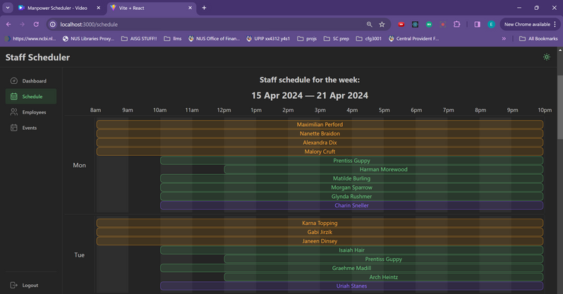
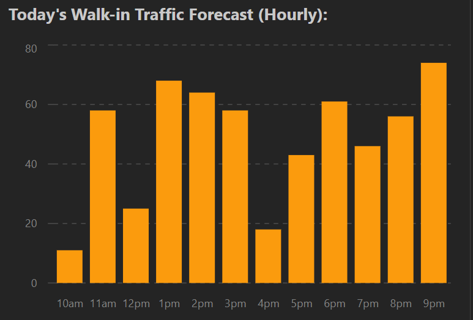
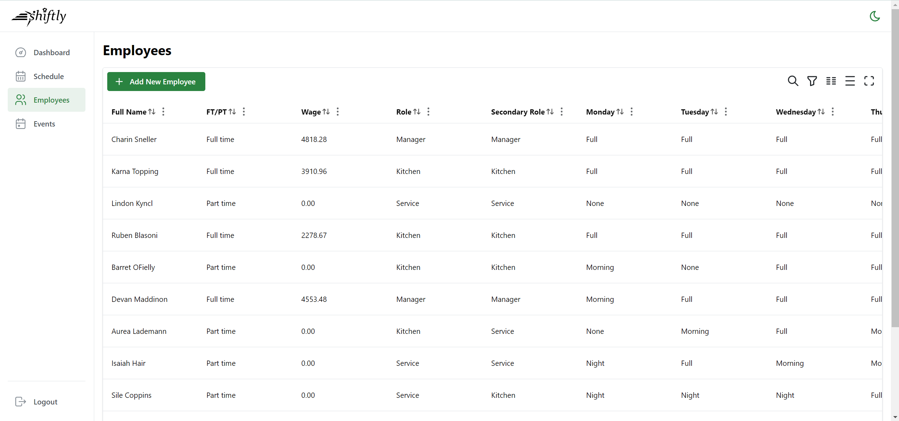
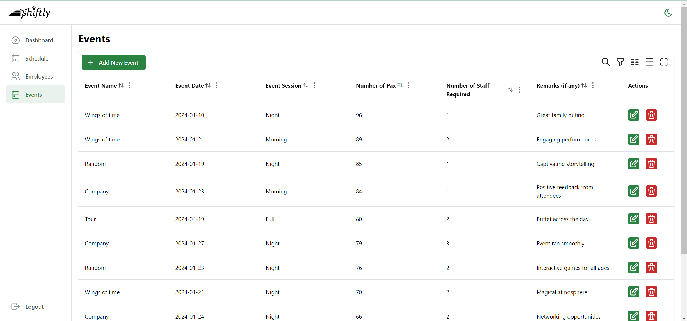

# RestaurantManager👨🏻‍🍳

RestaurantManager is a web application designed to help restaurant owners efficiently manage their weekly staff rosters and forecast customer demand. 

## Features

### 1. Automatic Roster Generation
Automatically creates a weekly staff roster for the week ahead based on demand forecasts and staff availability.



### 2. Demand Forecasting
Using an `ARIMA` (AutoRegressive Integrated Moving Average) model, the application predicts the expected number of customers for the current week.



### 3. Employee and Events Management
Easily manage employee details and events such as public holidays and special occasions.




## Getting Started

### Prerequisites
The entire application stack runs on docker, so please make sure you have [Docker](https://docs.docker.com/engine/install/) installed.

To get started clone this repository, navigate to into the directory and run the following commands:

```sh
git submodule init    # registers the frontend and backend repos as submodules
git submodule update  # pulls the submodule repos
docker compose up -d  # run the entire stack (MySQL, Flask API, React App) in detached mode
```

Once all containers are running the frontend app should now be accessible on port 3000. See `docker-compose.yml` for the port mappings for each service. Alternatively, you can also clone the frontend and backend repos separately and run them manually. See their respective repos for more information.

To login to the app, use the credentials `manager` and `pword123`.

## Credits
This project would not have been possible without the hard work and dedication of the following **AMAZING** contributors:
- [@shecheeyee](https://github.com/shecheeyee)
- [@mersoncheong](https://github.com/mersoncheong)
- [@aarontxz](https://github.com/aarontxz)
- [@kevin-pek](https://github.com/kevin-pek)
- [@asstella](https://github.com/asstella)
- [@chanyuxin](https://github.com/chanyuxin)
- [@fadilahzak](https://github.com/fadilahzak)